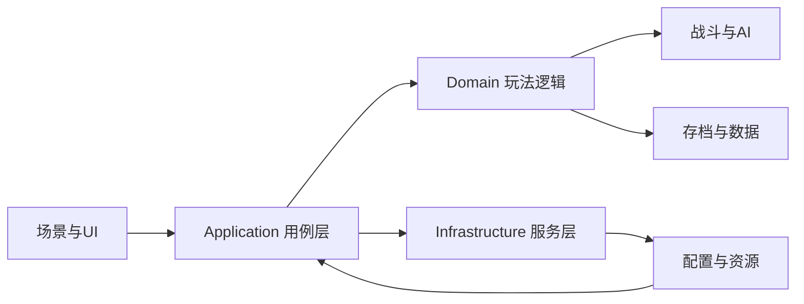

# 谢宇轩 | Unity 游戏客户端开发

> Unity 游戏客户端开发实习生 2027 届 ｜ 2026 年 9 月起可到岗 ｜ 每周 5 天 ｜ 可实习 6 个月

## 游戏演示

<!--
上传演示视频到 B 站、YouTube 或项目 Releases 后：
1. 把 YOUR_VIDEO_URL_HERE 替换成实际视频地址
2. 取消下面链接前的注释

[观看游戏演示视频](YOUR_VIDEO_URL_HERE)
-->

这是一个 Unity 客户端求职作品集页面。当前项目包含一款回合制卡牌战斗游戏、一款 2D 横板动作游戏，以及一个开源 Unity 编辑器工具。

## 我是谁

软件工程本科在读，2027 年毕业。能够独立把玩法需求拆解为 Unity 客户端方案，并完成从资源、UI、场景、战斗、AI、存档到编辑器工具的实现与调试。

求职方向是 Unity 游戏客户端开发。相较于只描述架构，我更关注一个功能是否能稳定运行、是否方便策划配置，以及是否便于后续维护和扩展。

## 项目

### 回合制卡牌战斗游戏 | Unity / 团结引擎

**项目地址：** [github.com/AnnaEvergarden/Card-strategy-game](https://github.com/AnnaEvergarden/Card-strategy-game)

独立完成的卡牌战斗客户端，覆盖启动、登录、大厅、编队、抽卡养成、关卡选择、回合制战斗与结算。

- **完整可玩闭环：** 完成从客户端启动到战斗结算的全流程，不只是一个战斗 Demo。
- **战斗稳定性：** 回合状态机配合技能管线，技能步骤支持失败回滚，避免单个异常破坏整场状态。
- **配置化内容生产：** 卡牌、技能、关卡和抽卡池使用 ScriptableObject 表驱动配置，策划无需改代码即可扩展内容。
- **资源与场景管理：** 使用 Addressables 和 UniTask 统一加载流程，通过引用计数缓存和资源组释放减少卡顿与内存增长。
- **热更与存档：** 实现资源更新校验、断点续传、加密存档和原子写入，降低更新失败与存档损坏风险。
- **敌人 AI 与性能：** Utility AI 按候选技能评分，难度与权重可配置；使用对象池和事件快照减少运行时 GC。
- **编辑器工具：** 开发配置导入导出、资源寻址查询和配置校验工具，减少内容生产中的重复操作。

<!--
上传截图到 docs/screenshots/ 后，取消下面的图片注释：

-->

### 2D 横板动作游戏 | Unity

个人开发练习，覆盖角色动作、战斗反馈、镜头控制和技能树配置。

- 使用 Animator 和 FSM 实现移动、跳跃、冲刺、墙跳、下落和攻击连击。
- 实现敌人 AI、攻击判定、受击表现、相机跟随和视差背景。
- 使用 Cinemachine 与 Unity Physics 处理镜头和碰撞，减少抖动与漏判。
- 使用 ScriptableObject 描述技能树节点和前后置依赖，方便扩展解锁关系。

### Missing Reference Finder

**项目地址：** [github.com/AnnaEvergarden/missing-reference-finder](https://github.com/AnnaEvergarden/missing-reference-finder)

开源的 Unity 编辑器工具，可以一键扫描项目中的缺失资源引用和 Missing Script，支持全部资源、选中资源和当前场景三种扫描范围，并提供导出报告与点击定位功能。

## 核心能力

| 分类 | 内容 |
| --- | --- |
| 编程语言 | C#、.NET 异步编程、LINQ |
| 游戏引擎 | Unity、团结引擎 |
| 客户端模块 | UGUI、Animator、Addressables、UniTask、DOTween、TextMeshPro |
| 工程能力 | 表驱动配置、事件解耦、对象池、性能分析、资源生命周期管理 |
| 开发工具 | Git、Unity Profiler、Addressables Profiler、AI 编程辅助 |

## 求职状态

- 求职意向：Unity 游戏客户端开发实习生
- 毕业时间：2027 年 6 月
- 到岗时间：2026 年 9 月起
- 实习时长：6 个月，每周 5 天
- 院校专业：湖南理工大学（原湖南理工学院）软件工程本科

## 联系方式

- GitHub：[AnnaEvergarden](https://github.com/AnnaEvergarden)
- 邮箱：2936356068@qq.com / htxjnmka@gmail.com
- 手机：193-2493-1089
